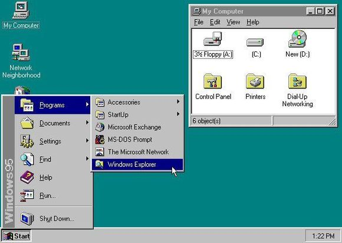

## Why Use a UI Framework?

It is without a doubt that UI frameworks are important to making nice looking websites. The difference when using a framework and not using one is like comparing a Windows 95 interface to a Windows 10's. They just look worlds apart.

  

    
  

  

    
  

Simply put, raw css and html can only get you so far when making an attractive website. Using a framework gives the programmer an easier time developing a webpage at the cost of needing to learn said framework; and there are a lot of different frameworks out there. However, all these different frameworks are maybe 80~90% similar so learning the first one is a big step that will open the door to many other frameworks.

## Bootstrap

My first framework that I learned was <a href="https://github.com/erikhuan/ics415F15">Bootstrap</a>. I never really went into depth with the language, but what I did learn from using it was how easy it was to make columns on pages and just structuring the layout in general. Bootstrap allowed me to make simple webpages that were responsive to how large the screen size was for the user. If the user shrank their window the webpage would accomodate for the size and rearrange the contents on the page to fit the window. However, looking back at my code there are a lot of different tags listed throughout my html files. While it might be useful to immediately what a certain line does, needing to remember what tag to use while programming could get confusing.

## Semantic UI

This year I'm learning how to use Semantic UI; it's pretty straight forward. With Semantic UI you are pretty much only declaring 'div' scripts with the occasional 'a' or 'h' tags. Everything about Semantic UI is focused in the class. You generally can "say" what you want and there will be something close to it in the library. For example, if you wanted a large red label you give the class "ui large red label". Want a medium sized image with rounded corners? "ui medium rounded image". It really is that easy. The only difficult part that I've had with Semantic UI so far would probably be positioning my content where I'd wnat them to be and how they should fill the space they are in. I'm sure the language has the proper tools that I need, I just need to find and learn them.
