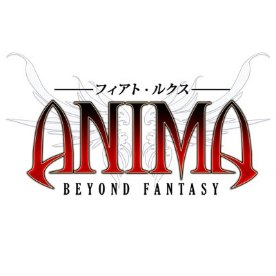

## Why Anima

There are lots of different table top role playing games (TTRPGs) available. Some widely known paper and pen TTRPGs for example are Dungeons and Dragons (DnD), Pathfinder, and Shadowrun. Each game provides their own set of rules and character creation for players to follow. Some may even have their own defined world with its own lore for players to use rather than making up their own adventure or just having a typical dungeon crawler in some dark cave or tower. Anima: Beyond Fantasy is one of those TTRPGs that has its own world with its own stories and legends that players can choose to explore, create, or even destroy if they wish. Also not common among most TTRPGs, Anima's dice system uses d100 rolls with occasional d10 rolls. With a larger numerical value, player characters can arguably be more diverse early on. This on top of 20 base character classes, over 50(?) advantages and disadvantages, 9 other races, and more give way to a very flexible character creation that allows you to make almost anything you want. That's not even going into how your character will fight. If you want to hear me and my friends talk about the game just click the link below to our podcast website.

<a href="https://90nup.com/">90 'n' Up Podcast</a>
