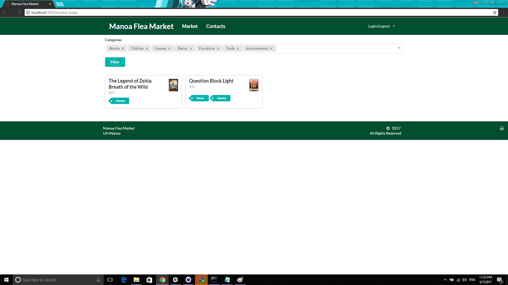

## Our Goal

When you go to an actual flea market it is held at a venue where there are sellers displaying their wares. The Manoa Flea Market was to be a literal online flea market for students and faculty registered under the UH system. Users could edit their profile and add listings for other users to see. When exploring the website you can either visit the Market to look and filter through all items, view Contacts to see all available users, or visit another user's profile to see all items they are selling.

## What was Accomplished

Creating this website was much more difficult than I initially had thought. I was the one who suggested the design of the website; users could browse the open market or view individual user profiles to see what they were selling exclusively. Unfortunately getting the base of the website to work was challenging already. We divided the workload so that one person worked on adding and finding other users, one worked on the general layout of the website and the item listings' page, and lastly the market itself. I worked on the market portion.

First off I should explain that the template we started with was really inefficient and that in hindsight we should have switched it over much earlier while we still could. But we stuck with what we had. Getting the Market page to load properly was not even the difficult part for me. I kept running into small errors that just made my build not work at all. It was really frustrating and funny to find where the problem was, but it did not change the fact that I wasn't getting a lot of work done at all. Eventually I was able to make the Market page like so.

It looked good, the Category tags were working and the two test items I had reacted properly. If only I had more time I could try figure out how to properly display each individual item in their own page. I imagine the code would be something like looping through the database and finding the matching item, then sending that to a template that would propagate the Item page with all the correct information.

## In Conclusion

I learned quite a bit from this experience. Making a pretty looking website is easy, but making a functional website is 100x harder. A lot more things will break on you and sometimes test data won't update for some reason. But I have some general idea of how to make a website at least, and if I take the time to make some more websites for practice I'm sure that I can eventually make a professional looking site that works. If you are curious about the website that my group built here's a <a href="https://manoa-flea-market.github.io/">link to our Github Pages</a>.